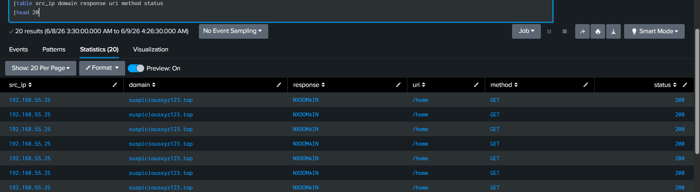

# Full Attack Chain Analysis using Splunk

## Overview

This project demonstrates the investigation of a multi-stage cyber attack using Splunk. The objective was to identify suspicious DNS activity, SQL injection attempts, malicious file upload activity, and webshell execution leading to system compromise.

---

## Lab Environment

* Platform: Splunk Enterprise
* Log Type: Simulated DNS and HTTP Logs
* Purpose: SOC Investigation Practice
* Analyst: Bharath

---

## Attack Flow

1. Suspicious DNS Activity
2. SQL Injection Attempt
3. Malicious File Upload
4. Webshell Execution
5. System Compromise

---

## Stage 1 – DNS Anomaly Detection

### Findings

* Internal Host: 192.168.55.25
* Suspicious Domain: suspiciousxyz123.top
* DNS Response: NXDOMAIN
* Approximately 100 suspicious DNS requests observed

### Analysis

The host generated repeated DNS requests to a suspicious domain resulting in NXDOMAIN responses. This behavior may indicate Domain Generation Algorithm (DGA) activity or malware beaconing.

### Screenshot

---

## Stage 2 – SQL Injection Detection

### Findings

* URI:
  `/login.php?user=admin' OR '1'='1`
* Approximately 80 SQL injection requests observed

### Analysis

The URI contains a classic SQL injection payload attempting authentication bypass.

### Screenshot

---

## Stage 3 – Malicious File Upload

### Findings

* Endpoint: `/upload.php`
* Method: POST
* Status: 200
* Approximately 80 upload requests observed

### Analysis

Successful file upload activity was observed through the upload endpoint, indicating an attempt to place a malicious file on the target server.

### Screenshot

---

## Stage 4 – Webshell Execution

### Findings

* Endpoint: `/uploads/shell.php`
* Method: GET
* Status: 200
* Approximately 80 execution requests observed

### Analysis

Successful access to the uploaded shell indicates post-exploitation activity and possible attacker interaction with the compromised system.

### Screenshot

---

## Attack Overview

The following screenshot shows the complete attack chain from DNS activity through post-exploitation.

### Screenshot

---

## Final Conclusion

The investigation identified a multi-stage attack involving suspicious DNS activity, SQL injection attempts, successful file upload activity, and successful webshell execution.

Successful execution of `shell.php` indicates confirmed post-exploitation activity and potential full system compromise.

---

## Severity

**Critical**

---

## Recommended Actions

* Isolate the affected server
* Block attacker IP address
* Remove malicious files
* Review server activity and persistence mechanisms
* Perform forensic investigation
* Reset affected credentials if required
* Escalate to L2/L3 teams

---

## Skills Demonstrated

* Splunk SIEM Investigation
* DNS Log Analysis
* SQL Injection Detection
* Webshell Detection
* Attack Correlation
* Incident Analysis
* Security Reporting
* Threat Investigation

---

## Queries

See [queries.txt](./queries.txt)
