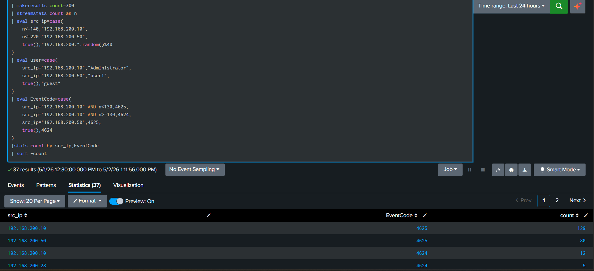
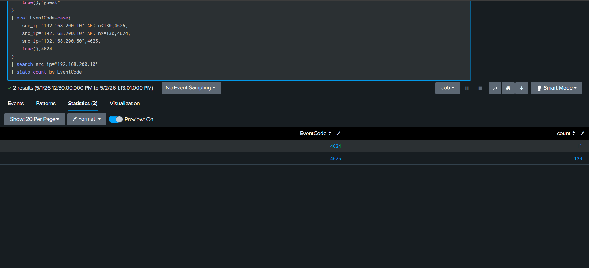
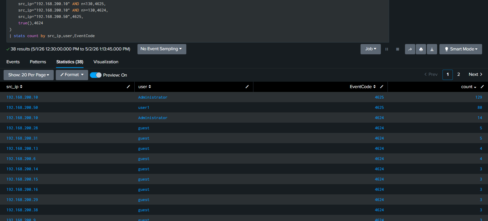
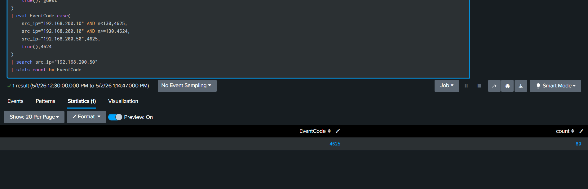
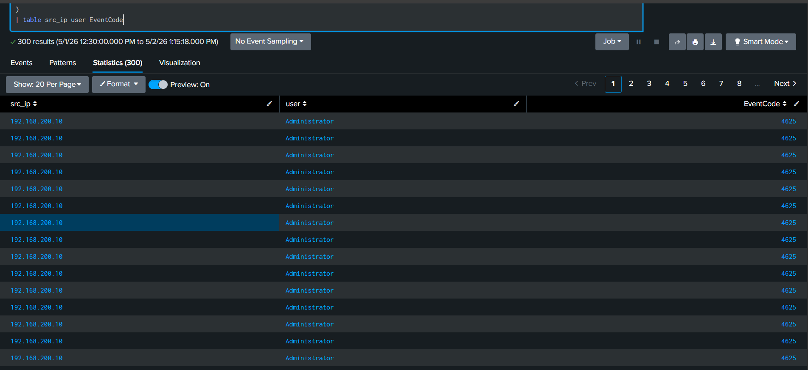

# SOC Log Analysis using Splunk (Windows Logs)

## Overview

This scenario was performed in a lab environment to analyze Windows authentication logs using Splunk. The objective was to detect suspicious login behavior, identify brute-force attacks, and determine whether a compromise occurred.

---

## Lab Setup

* Environment: Local Splunk instance
* Data: Simulated Windows authentication logs
* Purpose: Detect brute-force attacks and analyze login events

---

## Scenario — Windows Brute Force Detection

### Description

Analysis of Windows Security logs revealed multiple failed login attempts from internal IPs, followed by a successful authentication from one IP.

---

### Findings

* Suspicious IPs:

  * 192.168.200.10
  * 192.168.200.50

* Target Users:

  * Administrator (192.168.200.10)
  * user1 (192.168.200.50)

* Activity:

  * 192.168.200.10:

    * ~129 failed login attempts (Event ID 4625)
    * Followed by successful login (Event ID 4624)

  * 192.168.200.50:

    * ~80 failed login attempts (Event ID 4625)
    * No successful login observed

---

### Analysis

The pattern of multiple failed login attempts (Event ID 4625) followed by successful authentication (Event ID 4624) indicates a brute-force attack with possible compromise.

The second IP showed only failed attempts, indicating an unsuccessful attack.

This was identified using SPL queries such as:

| stats count by src_ip, EventCode
| search src_ip="192.168.200.10"
| stats count by EventCode

---

### Severity

High (due to successful authentication after repeated failures)

---

### Action

* Block IP 192.168.200.10
* Reset Administrator credentials
* Enforce MFA
* Review post-login activity
* Monitor or block 192.168.200.50

---

### [Screenshots](./screenshots)

---

## Queries

See [queries.txt](./queries.txt)

---

## Tools Used

* Splunk (SPL queries)
* Windows Security Logs

---

## Key Skills Demonstrated

* Windows log analysis (Event ID 4624 / 4625)
* Brute-force attack detection
* Compromise identification
* Incident investigation and reporting

