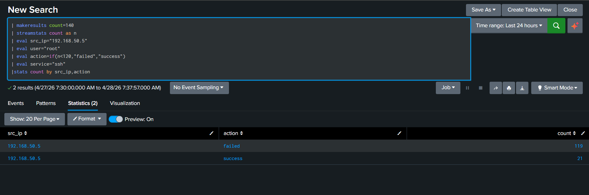

# SSH Brute Force Analysis

## Overview

Detected a brute-force attack on SSH service through log analysis.

---

## Findings

* IP: 192.168.50.5
* User: root
* ~119 failed login attempts
* Followed by successful authentication

---

## Evidence

* ~119 failed SSH login attempts from a single IP
* Successful login observed after repeated failures
* Same IP targeting the root account

---

## Conclusion

Brute-force attack detected with successful login, indicating possible unauthorized access.

---

## Severity

High

---

## Action

* Block IP 192.168.50.5
* Reset root credentials / enforce MFA
* Review system activity after login
* Escalate to L2

---

## Queries

See [queries.txt](./queries.txt)
