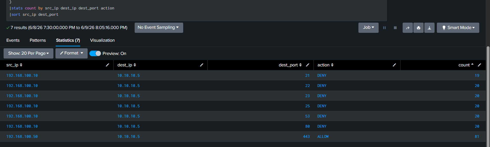
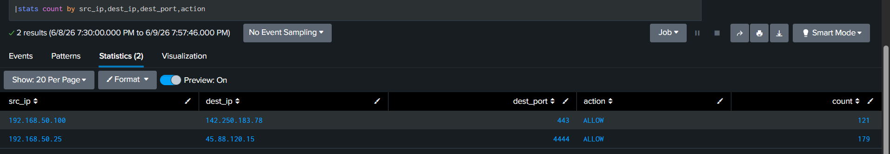
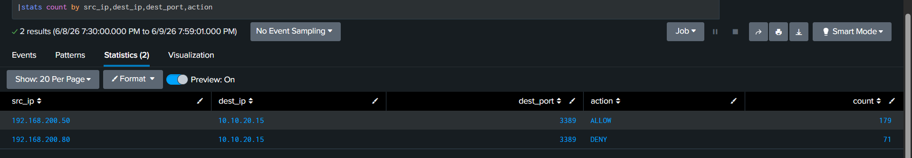

# Firewall Log Analysis using Splunk

## Overview

This project demonstrates firewall log analysis using Splunk. Multiple firewall scenarios were investigated to identify suspicious network activity, reconnaissance attempts, unusual outbound connections, and Remote Desktop Protocol (RDP) access patterns.

---

## Lab Environment

* Platform: Splunk Enterprise
* Log Type: Firewall Logs
* Purpose: SOC Investigation Practice
---

# Scenario 1 – Port Scanning Detection

## Description

A source IP attempted connections to multiple destination ports on the same host.

## Findings

* Source IP: 192.168.100.10
* Destination IP: 10.10.10.5
* Targeted Ports:

  * 21 (FTP)
  * 22 (SSH)
  * 23 (Telnet)
  * 25 (SMTP)
  * 53 (DNS)
  * 80 (HTTP)
* Action: DENY

## Analysis

The source host attempted connections to multiple ports on the same destination system. This behavior is consistent with reconnaissance or port scanning activity.

## Severity

Medium

## Action

* Block source IP if unauthorized
* Monitor for repeated scanning activity
* Review additional reconnaissance attempts

### Screenshot

---

# Scenario 2 – Suspicious Outbound Traffic

## Description

An internal host established repeated outbound connections to an external IP using an unusual destination port.

## Findings

* Internal Host: 192.168.50.25
* External IP: 45.88.120.15
* Destination Port: 4444
* Action: ALLOW

## Analysis

Repeated outbound communication to an external IP over port 4444 may indicate suspicious outbound traffic or possible command-and-control (C2) communication.

## Severity

High

## Action

* Investigate endpoint activity
* Review destination reputation
* Monitor outbound communications

### Screenshot

---

# Scenario 3 – RDP Access Analysis

## Description

Multiple RDP connection attempts were observed toward an internal system.

## Findings

* Source IPs:

  * 192.168.200.50
  * 192.168.200.80
* Destination IP: 10.10.20.15
* Port: 3389 (RDP)
* Actions:

  * ALLOW
  * DENY

## Analysis

Firewall logs indicate RDP traffic toward the target host. Additional authentication logs are required to determine whether successful logins occurred and whether the activity was legitimate or suspicious.

## Severity

Medium

## Action

* Verify authorized RDP access
* Review Windows authentication logs
* Monitor RDP activity

### Screenshot

---

## Skills Demonstrated

* Firewall Log Analysis
* Port Scan Detection
* Suspicious Outbound Traffic Investigation
* RDP Traffic Analysis
* Security Monitoring
* Incident Investigation
* Splunk SIEM Analysis

---

## Queries

See [queries.txt](./queries.txt)

## Dataset

See [dataset.txt](./dataset.txt)
