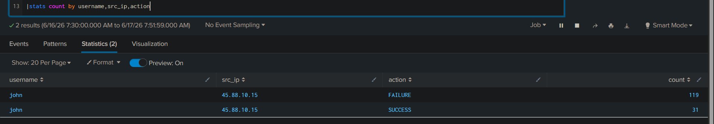
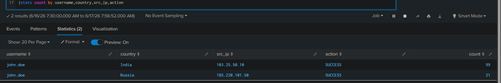
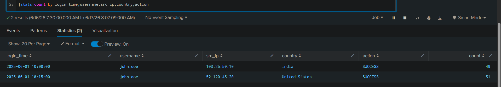

# VPN Log Analysis using Splunk

## Overview

This project demonstrates VPN log analysis using Splunk. Multiple VPN scenarios were investigated to identify suspicious authentication activity, possible credential compromise, unusual login locations, and impossible travel behavior.

---

## Lab Environment

* Platform: Splunk Enterprise
* Log Type: VPN Logs
* Purpose: SOC Investigation Practice
* Analyst: Bharath

---

# Scenario 1 – VPN Brute Force Detection

## Description

A user account experienced multiple failed VPN authentication attempts followed by successful logins.

## Findings

* User: john
* Source IP: 45.88.10.15
* Failed Attempts: 119
* Successful Logins: 31

## Analysis

Multiple failed authentication attempts followed by successful VPN access indicate a possible brute-force attack and potential account compromise.

## Severity

High

## Action

* Review account activity
* Reset credentials if required
* Enable MFA
* Escalate for further investigation

### Screenshot

---

# Scenario 2 – Suspicious Country Login

## Description

A user account successfully authenticated from an unusual geographic location.

## Findings

* User: john.doe
* Countries:

  * India
  * Russia
* Login Status: SUCCESS

## Analysis

Successful authentication from an unusual country may indicate credential misuse or unauthorized access. Additional verification is required.

## Severity

Medium-High

## Action

* Verify login with user
* Review account activity
* Enable MFA
* Investigate unusual access

### Screenshot

---

# Scenario 3 – Impossible Travel Detection

## Description

A user account authenticated from geographically distant locations within a short time period.

## Findings

* User: john.doe
* Countries:

  * India
  * United States
* Time Difference:

  * 15 Minutes
* Login Status: SUCCESS

## Analysis

Successful authentication from geographically distant locations within a short timeframe is consistent with impossible travel behavior and may indicate credential compromise.

## Severity

High

## Action

* Verify user activity
* Review account access
* Enable MFA
* Investigate potential credential compromise

### Screenshot

---

## Skills Demonstrated

* VPN Log Analysis
* Authentication Investigation
* Brute Force Detection
* Suspicious Country Login Detection
* Impossible Travel Detection
* Security Monitoring
* Incident Investigation
* Splunk SIEM Analysis

---

## Queries

See [queries.txt](./queries.txt)

## Dataset

See [dataset.txt](./dataset.txt)

