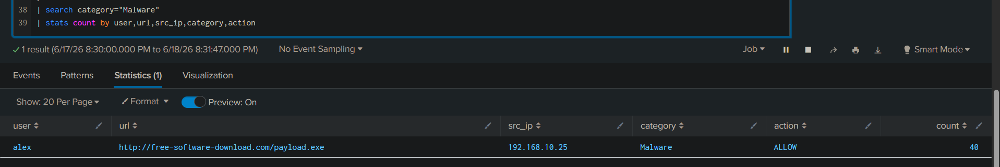
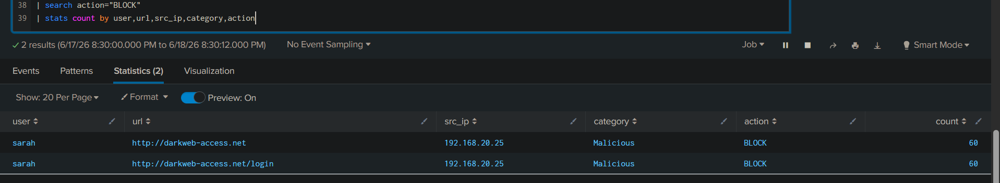
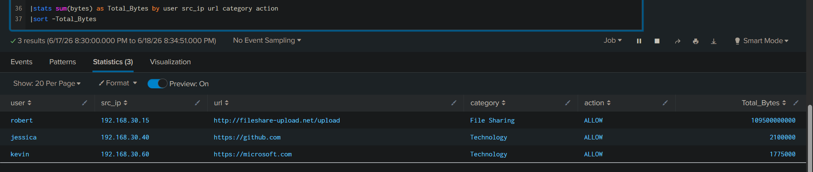

# Proxy Log Analysis using Splunk

## Overview

This project demonstrates proxy log analysis using Splunk. Multiple proxy scenarios were investigated to identify malicious downloads, blocked website access attempts, and potential data exfiltration activity.

---

## Lab Environment

* Platform: Splunk Enterprise
* Log Type: Proxy Logs
* Purpose: SOC Investigation Practice

---

# Scenario 1 – Malware Download Detection

## Description

A user accessed a malware-classified website and downloaded executable files through web traffic.

## Findings

* User: alex
* Source IP: 192.168.10.25
* URL: http://free-software-download.com/payload.exe
* Category: Malware
* Action: ALLOW
* Malware Accesses: 40

## Analysis

The user accessed a website categorized as Malware and downloaded executable content. Since the proxy allowed the traffic, there is a risk of malware delivery to the endpoint.

## Severity

High

## Action

* Investigate endpoint activity
* Submit downloaded file to sandbox
* Block malicious URL/domain
* Review endpoint security alerts

### Screenshot

---

# Scenario 2 – Blocked Malicious Website Access

## Description

A user repeatedly attempted to access malicious websites that were blocked by the proxy server.

## Findings

* User: sarah
* Source IP: 192.168.20.25
* URLs:

  * http://darkweb-access.net
  * http://darkweb-access.net/login
* Category: Malicious
* Action: BLOCK
* Attempts: 120

## Analysis

The user repeatedly attempted to access malicious websites. The proxy successfully blocked all requests, preventing access to the destination websites.

## Severity

Medium

## Action

* Verify user activity
* Review endpoint security alerts
* Monitor for repeated attempts
* Escalate if suspicious activity continues

### Screenshot

---

# Scenario 3 – Possible Data Exfiltration

## Description

A user transferred a large amount of data to a file-sharing website.

## Findings

* User: robert
* Source IP: 192.168.30.15
* URL: http://fileshare-upload.net/upload
* Category: File Sharing
* Action: ALLOW
* Total Data Transferred: 109,500,000,000 bytes

## Analysis

A large volume of outbound traffic was sent to a file-sharing service. This behavior is consistent with possible data exfiltration; however, proxy logs alone cannot confirm that sensitive data was transferred.

## Severity

High

## Action

* Investigate transferred files
* Review endpoint activity
* Verify business justification
* Monitor for additional uploads
* Escalate to L2

### Screenshot

---

## Skills Demonstrated

* Proxy Log Analysis
* Malware Download Investigation
* URL Analysis
* Web Traffic Monitoring
* Data Exfiltration Detection
* Security Monitoring
* Incident Investigation
* Splunk SIEM Analysis

---

## Key Lessons Learned

* Malware + ALLOW = High Risk
* Malware + BLOCK = Lower Risk
* Large Upload + File Sharing = Possible Data Exfiltration
* Proxy Logs do not confirm malware execution
* Proxy Logs do not confirm data theft
* Evidence → Analysis → Conclusion

---

## Queries

See [queries.txt](./queries.txt)

## Dataset

See [dataset.txt](./dataset.txt)

