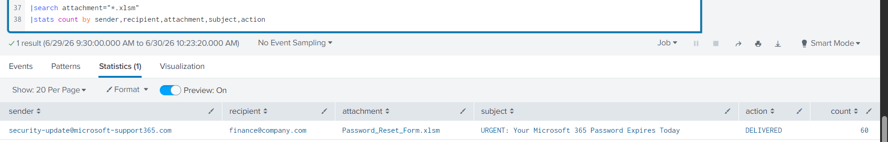
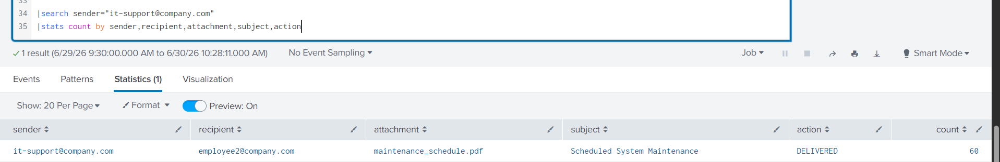
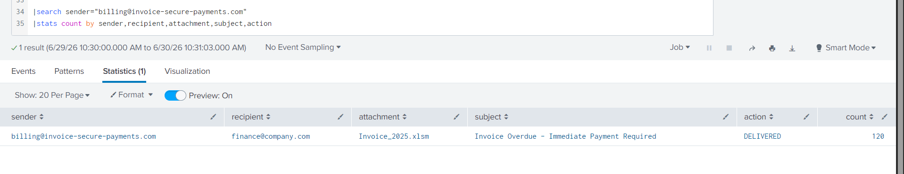

# Email Security Analysis using Splunk

## Overview

This project demonstrates email security log analysis using Splunk SIEM. Three realistic email security scenarios were investigated to identify phishing emails, validate false positives, detect malicious attachments, and perform SOC-style incident analysis.

---

## Lab Environment

- Platform: Splunk Enterprise
- Log Type: Email Security Logs
- Purpose: SOC Investigation Practice

---

## Lab Background

### Organization Domain

company.com

### Trusted Domains

- company.com
- github.com
- linkedin.com
- zoom.us

### Attacker-Controlled Domains

- microsoft-support365.com
- invoice-secure-payments.com

### Objective

Investigate email logs to:

- Detect phishing emails
- Differentiate legitimate emails from false positives
- Identify malicious attachments
- Practice SOC investigation workflow
- Write incident reports

---

# Scenario 1 – Phishing Email Detection

## Description

A phishing email impersonating Microsoft was delivered to an employee with a macro-enabled attachment.

## Findings

- Sender: security-update@microsoft-support365.com
- Recipient: finance@company.com
- Subject: URGENT: Your Microsoft 365 Password Expires Today
- Attachment: Password_Reset_Form.xlsm
- Action: DELIVERED

## Analysis

The sender impersonates Microsoft using a fake domain and includes a macro-enabled attachment. Although the email was delivered successfully, email logs alone cannot confirm whether the attachment was opened or executed.

## Severity

High

## Recommended Action

- Block sender/domain
- Remove email from mailboxes
- Verify attachment execution using EDR
- Review Windows and Proxy logs
- Escalate if execution is confirmed

### Screenshot

---

# Scenario 2 – Legitimate Email / False Positive

## Description

An internal IT notification generated an alert but contained no malicious indicators after investigation.

## Findings

- Sender: it-support@company.com
- Recipient: employee2@company.com
- Subject: Scheduled System Maintenance
- Attachment: maintenance_schedule.pdf
- Action: DELIVERED

## Analysis

The email originated from the organization's internal domain, contained a standard PDF attachment, and showed no signs of phishing or impersonation. The alert is classified as a false positive after validation.

## Severity

Low

## Recommended Action

- Verify sender authenticity
- Validate business purpose
- Close the alert as benign
- Escalate only if additional suspicious evidence appears

### Screenshot

---

# Scenario 3 – Malicious Invoice Phishing

## Description

A phishing email targeted the Finance department using an overdue invoice and a macro-enabled attachment.

## Findings

- Sender: billing@invoice-secure-payments.com
- Recipient: finance@company.com
- Subject: Invoice Overdue - Immediate Payment Required
- Attachment: Invoice_2025.xlsm
- Action: DELIVERED

## Analysis

The attacker used invoice-themed social engineering to target the Finance department. The email contains a macro-enabled attachment and requires endpoint investigation to determine execution.

## Severity

High

## Recommended Action

- Block sender/domain
- Remove malicious email
- Verify attachment execution
- Review EDR, Windows, and Proxy logs
- Escalate to L2 if execution is confirmed

### Screenshot

---

# Skills Demonstrated

- Email Security Analysis
- Phishing Detection
- False Positive Validation
- Attachment Investigation
- Social Engineering Detection
- Incident Investigation
- Security Monitoring
- Splunk SIEM Analysis

---

# Investigation Workflow

Alert

↓

Observation

↓

Evidence Collection

↓

Validation

↓

Impact Assessment

↓

Severity Assignment

↓

Escalation

↓

Incident Report

---

## Queries

See **queries.txt**

## Dataset

See **dataset.txt**