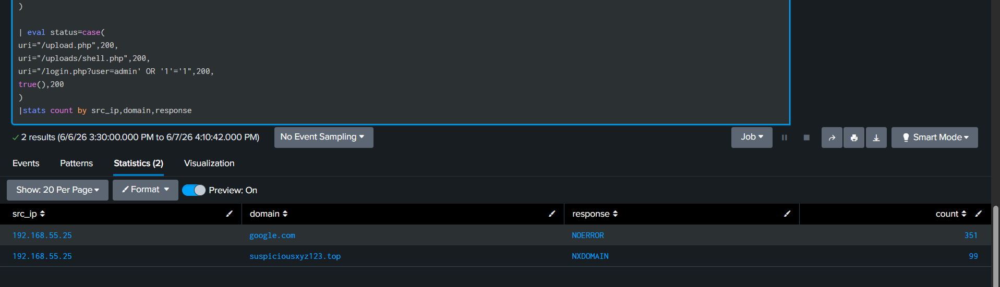
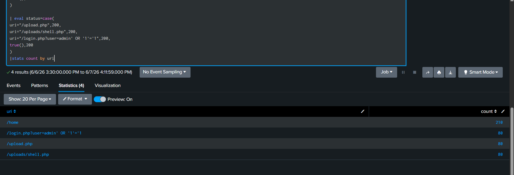
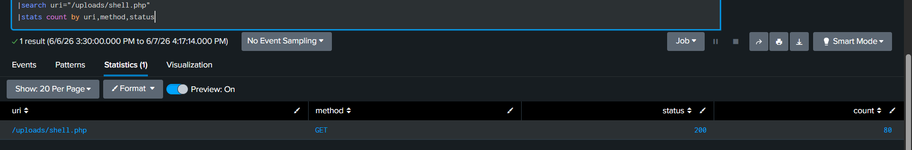

# Full Attack Chain Analysis using Splunk

## Overview

This project demonstrates a complete multi-stage attack investigation using Splunk. The attack chain includes suspicious DNS activity, SQL injection attempts, malicious file upload activity, and successful webshell execution leading to system compromise.

---

## Lab Setup

* Platform: Splunk
* Data Source: Simulated DNS and HTTP logs
* Environment: Local Lab
* Objective: Investigate and correlate attack stages from initial reconnaissance to post-exploitation.

---

## Attack Flow

DNS Anomaly Detection

        ↓

SQL Injection Attempt

        ↓

Malicious File Upload

        ↓

Webshell Execution

        ↓

System Compromise

---

## Stage 1 — DNS Anomaly Detection

### Findings

* Source IP: 192.168.55.25
* Suspicious Domain: suspiciousxyz123.top
* NXDOMAIN Responses: ~100

### Analysis

Repeated DNS requests to a suspicious domain combined with a high NXDOMAIN count may indicate DGA-based communication or malware-related activity.

### Screenshot

---

## Stage 2 — SQL Injection Detection

### Findings

* URI:
  /login.php?user=admin' OR '1'='1
* Requests: ~80
* Status Code: 200

### Analysis

Repeated SQL injection payloads targeting the login page may indicate attempts to bypass authentication controls.

### Screenshot

---

## Stage 3 — Malicious File Upload

### Findings

* Endpoint: /upload.php
* Method: POST
* Requests: ~80
* Status Code: 200

### Analysis

Successful file upload activity suggests that an attacker may have uploaded a malicious file or webshell.

### Screenshot

---

## Stage 4 — Webshell Execution

### Findings

* Endpoint: /uploads/shell.php
* Method: GET
* Requests: ~80
* Status Code: 200

### Analysis

Successful execution of the uploaded webshell indicates post-exploitation activity and potential attacker control of the server.

### Screenshot

---

## Final Conclusion

The source IP 192.168.55.25 demonstrated a complete multi-stage attack involving suspicious DNS activity, SQL injection attempts, successful file upload activity, and successful webshell execution.

Successful execution of shell.php confirms post-exploitation activity and indicates system compromise.

---

## Severity

Critical

---

## Recommended Actions

* Isolate affected server
* Block attacker IP address
* Remove malicious files
* Review persistence mechanisms
* Investigate affected systems
* Perform forensic analysis
* Escalate to L2/L3

---

## Queries

See [queries.txt](./queries.txt)

---

## Skills Demonstrated

* Splunk Log Analysis
* DNS Investigation
* SQL Injection Detection
* Webshell Detection
* Incident Response
* Attack Correlation
* SOC Investigation Workflow
