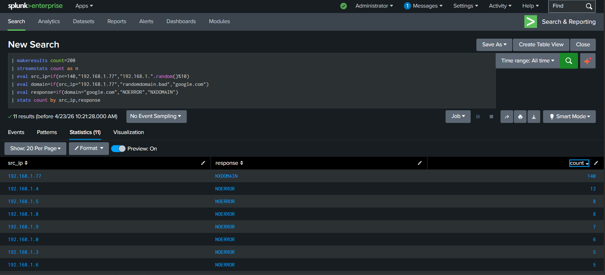
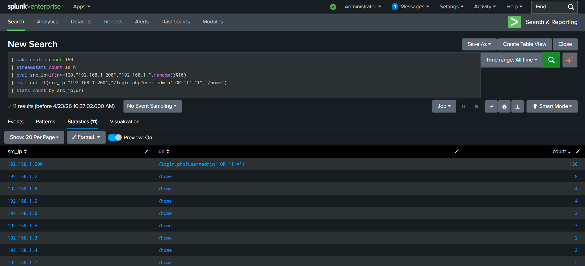
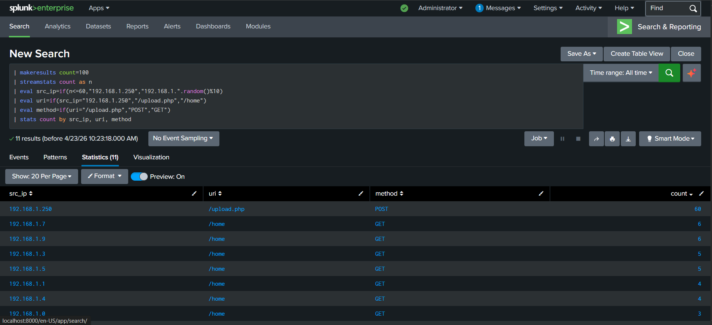
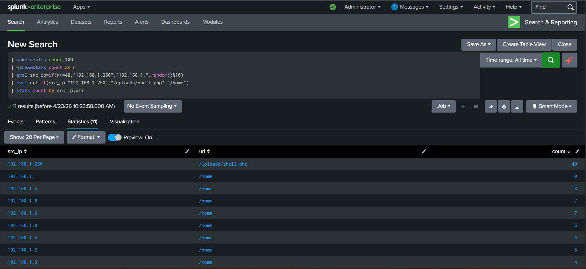

# SOC Log Analysis using Splunk

## Overview

These scenarios were performed in a lab environment to understand how security alerts are investigated using Splunk. DNS and HTTP logs were analyzed to identify suspicious patterns, correlate events, and document findings.

---

## Lab Setup

* Environment: Local Splunk instance
* Data: Simulated DNS and HTTP logs
* Purpose: Practice alert investigation and attack detection

---

## Scenario 1 — DNS Anomaly Detection

### Description

Analysis of DNS logs showed one internal IP generating a high number of failed queries.

### Findings

* IP: 192.168.1.77
* ~140 NXDOMAIN responses
* Repeated domains:

  * asdh123asd.xyz
  * randomdomain.bad

### Analysis

Repeated queries to random domains along with high NXDOMAIN responses indicate possible DGA behavior or malware communication.

### Severity

High

### Action

* Isolate affected host
* Block suspicious domains
* Perform endpoint scan

---

## Scenario 2 — SQL Injection Detection

### Description

HTTP log analysis revealed repeated login requests containing SQL injection payloads.

### Findings

* IP: 192.168.1.200
* Payload:
  /login.php?user=admin' OR '1'='1
* ~120 requests
* Status: 200

### Analysis

Successful responses to SQL injection payloads suggest possible authentication bypass.

### Severity

High

### Action

* Block attacker IP
* Enable WAF protection
* Review login activity

---

## Scenario 3 — Webshell Detection (Post-Exploitation)

### Description

Log analysis revealed file upload followed by repeated access to a suspicious file.

### Findings

* IP: 192.168.1.250
* Upload:
  POST /upload.php (~59 times)
* Execution:
  GET /uploads/shell.php (~41 times)

### Analysis

The same IP performed upload and execution, indicating webshell activity and possible system compromise.

### Severity

Critical

### Action

* Isolate affected server
* Remove malicious file
* Investigate for persistence

---

## Sample SPL Queries

DNS Analysis:
| stats count by src_ip, response

SQL Injection Detection:
| where like(uri,"%OR%1=1%")

Webshell Detection:
| search uri="/uploads/shell.php"

---

## Tools Used

* Splunk (SPL queries)
* DNS and HTTP log analysis

---

## Key Skills Demonstrated

* SIEM log analysis
* Detection of SQL injection, webshell, and DNS anomalies
* Incident investigation and reporting
____
Screenshots:

